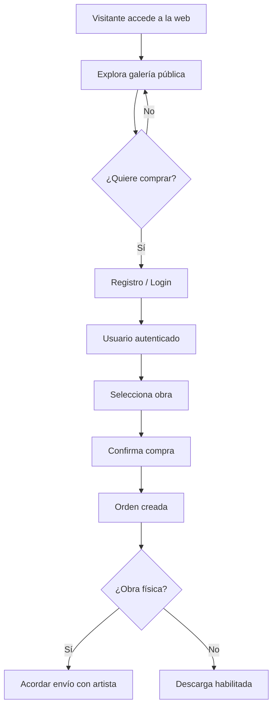
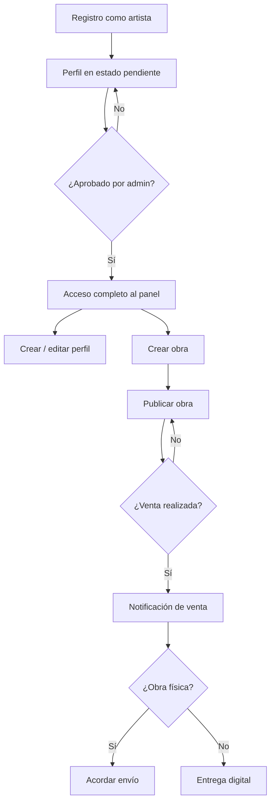
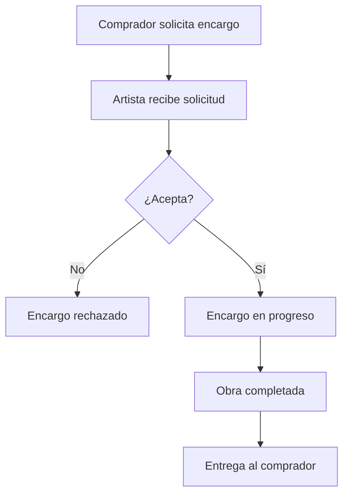
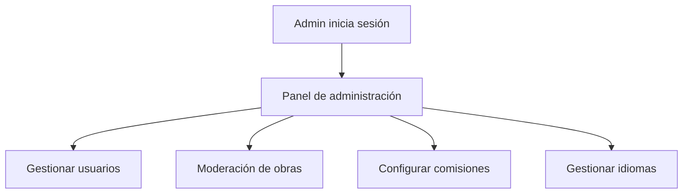

# Flujos de Usuario – Marketplace de Arte

Este documento describe los **flujos de usuario principales** de la plataforma según el rol. Su objetivo es alinear experiencia de usuario (UX), frontend y backend, evitando ambigüedades funcionales.

---

## 1. Flujo: Visitante → Comprador

### 1.1 Navegación pública
1. El usuario accede a la web sin autenticarse.
2. Visualiza la galería pública de obras.
3. Puede:
   - Filtrar obras
   - Acceder al detalle de una obra
   - Ver perfil público del artista

Restricciones:
- No puede comprar
- No puede solicitar encargos

---

### 1.2 Registro como comprador
1. El visitante pulsa "Registrarse".
2. Selecciona rol **Comprador**.
3. Introduce email y contraseña.
4. Confirma registro.
5. Accede a su área privada.

---

### 1.3 Compra de obra
1. Comprador autenticado accede al detalle de una obra.
2. Pulsa "Comprar".
3. Confirma compra.
4. El sistema:
   - Registra la orden
   - Aplica comisión
   - Marca la obra como vendida

Si la obra es física:
- Se habilita canal para acordar envío con el artista.

---

## 2. Flujo: Usuario Artista

### 2.1 Registro como artista
1. Visitante se registra como artista.
2. El sistema crea usuario con rol artist.
3. Estado inicial del perfil: **pendiente**.
4. Acceso limitado hasta aprobación (si aplica).

---

### 2.2 Creación de perfil artístico
1. Artista accede a su panel privado.
2. Completa:
   - Nombre artístico
   - Biografía
   - Imagen de perfil
   - Redes sociales
3. Guarda cambios.

---

### 2.3 Gestión de obras
1. Artista accede a "Mis obras".
2. Puede:
   - Crear nueva obra
   - Editar obra existente
   - Publicar / ocultar obra

Para obra física:
- Define dimensiones y peso

Para obra digital:
- Define formato y resolución

---

### 2.4 Venta y envío
1. Artista recibe notificación de venta.
2. Si la obra es física:
   - Contacta con comprador
   - Acuerdan método y coste de envío
3. Marca obra como enviada.

---

### 2.5 Encargos personalizados
1. Artista recibe solicitud de encargo.
2. Puede:
   - Aceptar
   - Rechazar
   - Negociar
3. Actualiza estado del encargo hasta completarlo.

---

## 3. Flujo: Usuario Administrador

### 3.1 Acceso
1. Admin accede mediante login.
2. Accede al panel de administración.

---

### 3.2 Moderación de artistas
1. Admin visualiza lista de artistas.
2. Puede:
   - Aprobar perfiles
   - Bloquear usuarios

---

### 3.3 Moderación de obras
1. Admin visualiza todas las obras.
2. Puede:
   - Ocultar obras
   - Eliminar contenido inapropiado

---

### 3.4 Configuración global
1. Admin accede a ajustes.
2. Modifica:
   - Comisión mínima
   - Idiomas disponibles

---

## 4. Principios de Flujo

- El usuario siempre sabe en qué estado está.
- Las acciones dependen estrictamente del rol.
- El administrador no interfiere en la creación artística.

---

Este documento sirve como base para diseño UX/UI y validación de permisos.

---

# 5. Diagramas de Flujo de Usuario

A continuación se incluyen **diagramas de flujo en formato Mermaid**, pensados para ser visualizados directamente en editores compatibles (GitHub, GitLab, VS Code).

---

## 5.1 Diagrama – Visitante → Comprador

---

## 5.2 Diagrama – Flujo de Artista

---

## 5.3 Diagrama – Encargos Personalizados

---

## 5.4 Diagrama – Flujo de Administrador

---

Estos diagramas complementan los flujos descriptivos y sirven como referencia visual para:
- Diseño UX/UI
- Implementación frontend
- Validación de lógica backend
- Documentación técnica del proyecto

